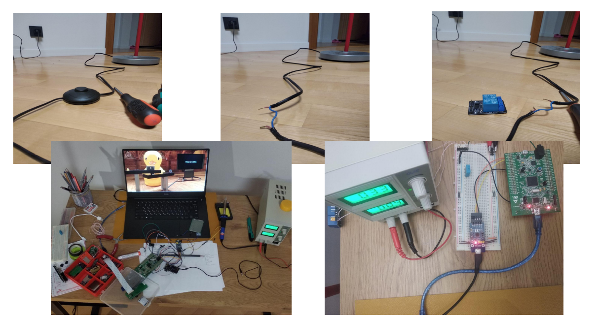
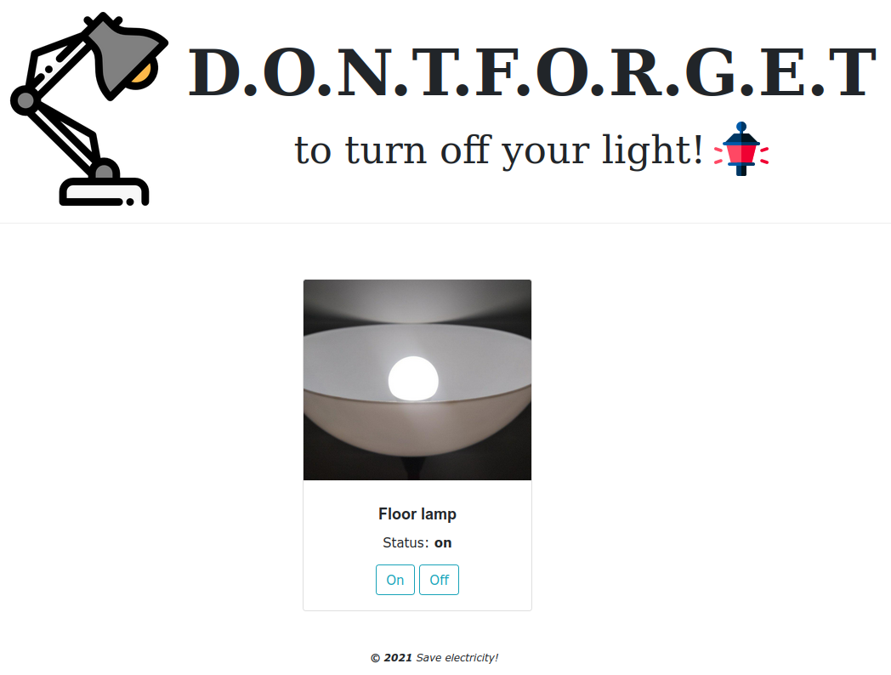
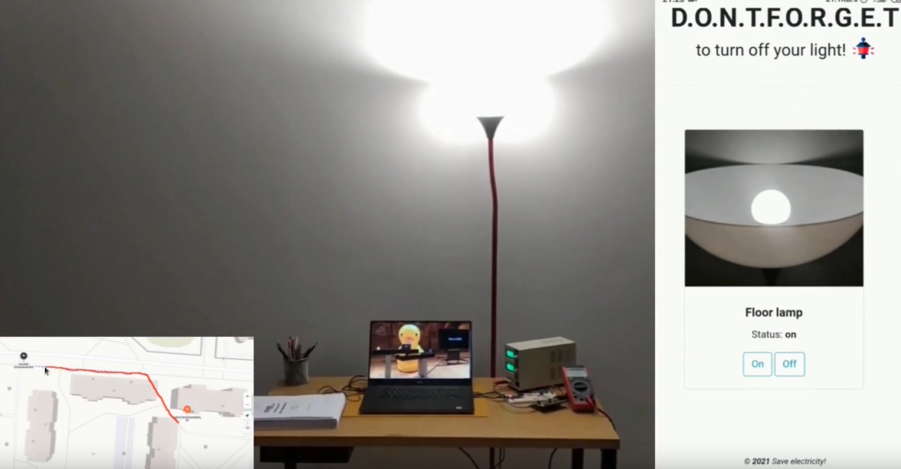
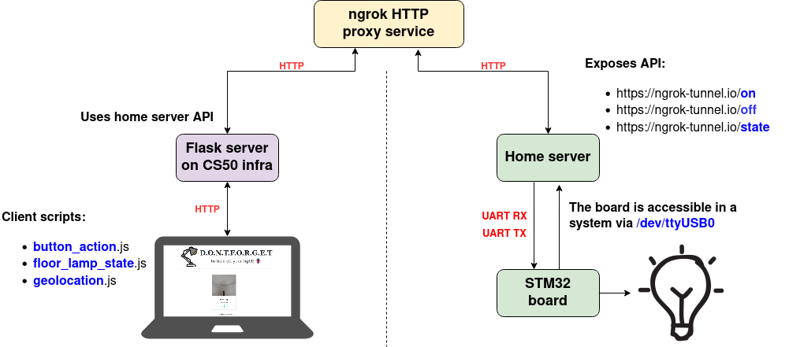

# D.O.N.T.F.O.R.G.E.T
#### Video Demo:  <https://youtu.be/RUafHTagNNA>
#### Short description:
A lot of people forget to switch off their light. I belong to them too. This project is my attemp to solve this problem for me with the help of home automation. It can help to reduce power consumption on our planet.







## Project requirement
To make all these stuff alive we have to split all project to three main parts:
 - Home electronics and microcontroller firmware to manage it.
 - Home server to expose APIs to the global network
 - Cloud http-server to manage a site and interact with users

:warning: **Make sure you use Linux**

### Electronics
 - [STM32F407](https://www.st.com/en/evaluation-tools/stm32f4discovery.html)
 - [Relay](https://www.amazon.com/Arduino-Relay-Module/s?k=Arduino+Relay+Module)
 - [USB-UART](https://www.amazon.com/Arduino-Relay-Module/s?k=usb+uart+adapter)

### Software
 - **gcc-arm-none-eabi** to build code for STM32 microcontroller
 - **stlink-tools** to have the ability to flash the microcontroller
 - **Linux build essentials** to build home server code

Check the [HELP.md](https://github.com/anisyanka/dont_forget/blob/main/HELP.md) to obtain these software.


### Get started:
```console
# Clone repos
git clone --recurse-submodules https://github.com/anisyanka/dont_forget.git
cd dont_forget

# Build firmware for STM32
make mcu

# Build home server to manage the electronic board
make home-server

# Insert USB-UART machine where home server will be run
# Find out what interface appears in your system. For instance: /dev/ttyUSB0

# Setup your interface
# Change the interface name inside Makefile if needed
make setup-uart-port

# Flash firmware to STM32
make flash

# Run home server
./home_server/build/homeserv

# Use ngrok to make the server accessible on th global network
ngrok http 8080

# Here we need to deploy web site
# Use CS50 infrastructure to make the site alive and run FLask
# Change 'HW_SERVER_ADR' and 'HW_HOME_LOCATION' in ./web_app/helpers.py to your values
cd web_app
flask run

# Go to the web site and check your lamp!
```


## Project architecture


### Microcontroller firmware
Firmware for the **STM32 board** works pretty straightforward.
There is infinite loop in `mcu/firmware/Src/main.c`. The board always just
wait for a new message via UART. Board obtains it via UART interrupts.

If your electronic stuff more than mine, you are able to add a new APIs for your device. To do it you can use `webcomm_register_action()` function.
For more information check the `mcu/firmware/Inc/web_communication.h` file.

Now my board supports the following APIs:
 - "L1\n" - turn on the floor lamp;
 - "L0\n" - turn off the floor lamp;
 - "LS\n" - get the floor lamp state.

Home server must send to the board these massages to manage the lamp.

:warning: **Home server must send '\n' symbol to point end of current message**

### Home server software
Home server uses [this](https://github.com/jeremycw/httpserver.h.git) C implementation of http server. It is needed to expose stm32 board APIs
to the global network. In `home_server/main.c` you can see the `handle_request` function. It is a main http request handler. 
Now the server supports the following APIs.
```C
static struct web_hw_match_cmd web_apis_list[] = {
	[ON] = { "/on", "L1\n" },
	[OFF] = { "/off", "L0\n" },
	[STATE] = { "/state", "LS\n" },
	[LAST] = { NULL, NULL },
};
```
To add something new you can add a new array item before the `[LAST]`.
The main http handler will parse input messages and compare with this struct.
If we have appropriach route, the home server will pass the massage to the STM32 bord with the help of `open() read() write()` syscalls.


### Flask http-server
This part of all software set uses the APIs were exposed by the home server
and handle http-requests from your client browser to manage the site.

Flask server objains several AJAXs from client:
 - `/floor_lamp_state` - to show current lamp status in UI.
 - `/location` - to turn off your floor lamp if you are not at home and you forgot to do it.


## Future works
 - More flexible protocol to add new devices for automation
 - The ability to add a new user to your home
 - TBD
